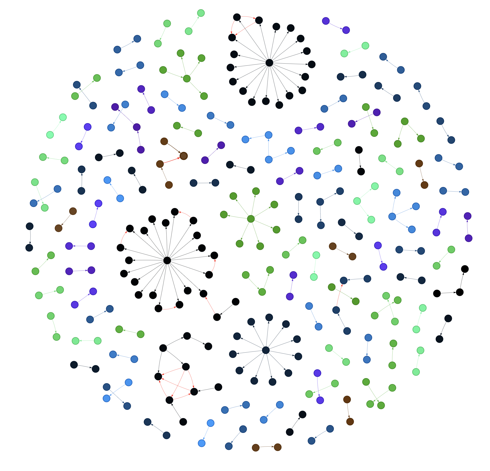

# Entity Resolution Pipeline

<p align="center">
  
</p>


### [Data used for Entity Resolution](https://github.com/raphelemmanuvel/entity-resolution-pipeline/blob/main/tmp/data/active_listings_x.csv)
### [Entity Relationship - Interactive Plot](https://raphelemmanuvel.github.io/entity-resolution-pipeline/)

### Usage


### Running web_crawler service to pull data from the source and parse it to output file.

* Search parameter for the crawler and the output file path can be configured with the command in docker-compose.yml.  

```sh
docker-compose run web_crawler
```  

### Running er service to visualize the relationship between companies, registered agents, and owners in the crawled data.

* Output file path for the plot can be configured with the command in docker-compose.yml.  

```sh
docker-compose run er
```  

### Format Python Scripts.

```sh
docker-compose run format
```  
