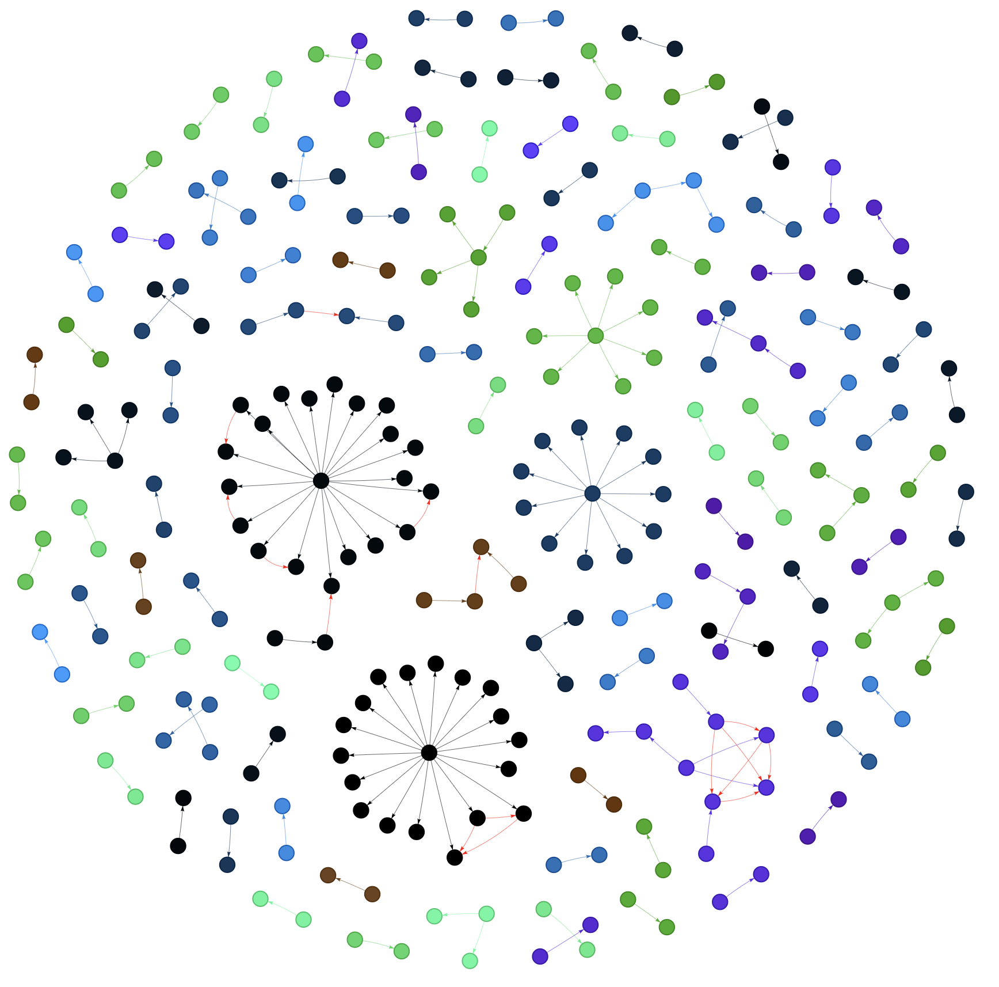

# Entity Resolution Pipeline

<p align="center">
  
</p>

## Overview

This pipeline is designed to perform entity resolution using data collected from [North Dakota Business Search](https://firststop.sos.nd.gov/search/business).
The pipeline consists of a web crawler to pull and parse data and an entity resolution (ER) service to visualize the relationship between entities.

### [Entity Relationship - Interactive Plot](https://raphelemmanuvel.github.io/entity-resolution-pipeline/)
Explore an interactive plot showcasing entity relationships.

### [Data Source](https://firststop.sos.nd.gov/search/business)
Access the original data source from which the data is crawled to use for this entity resolution pipeline.

### [Data used for Entity Resolution](https://github.com/raphelemmanuvel/entity-resolution-pipeline/blob/main/tmp/data/latest/active_companies_X.csv)
Find the crawled data used for the entity resolution process.


## Usage

### a. Usage with Docker Desktop (Recommended)

## Requirements

Make sure [Docker Desktop](https://www.docker.com/products/docker-desktop) is installed and running.


### 1. Run web_crawler service to pull and parse data.

Configure search parameters and output file path in docker-compose.yml and run:
[Default values form search param and output file path are set in services.py]

```sh
docker-compose run web_crawler
```

### 2. Run er service to visualize entity relationships.

Configure the path for input dataset and output file path for the plot and run:
[Default values form search param and output file path are set in services.py]


```sh
docker-compose run er
```


### 3. View generated entity relationships visualization in the browser.

```sh
docker-compose build view_er
```

```sh
docker-compose up view_er
```

Access the ER visualization in your browser http://localhost:8000.


### 4. Format Python Scripts.

```sh
docker-compose run format
```


### b. Usage with Poetry

### 1. Install Poetry

```sh
pip install poetry
```

### 2. Install entity_resolution_pipeline dependencies

```sh
cd entity_resolution_pipeline

poetry install
```

### 3. Run web_crawler service to pull and parse data.

```sh
poetry run er_pipeline run_crawler
```

### 4. Run er service to visualize entity relationships.

```sh
poetry run er_pipeline run_er
```

### 5. View generated entity relationships visualization in the browser.

```sh
poetry run er_pipeline view_er_in_browser
```

If you want to configure custom parameters for any of the above services with Poetry, use the below command to view configuration options for each service.

```sh
poetry run er_pipeline {service_name} --help
```

```sh
eg: poetry run er_pipeline run_crawler --help
```

### 6. Format Python Scripts.

```sh
poetry run black .
```
